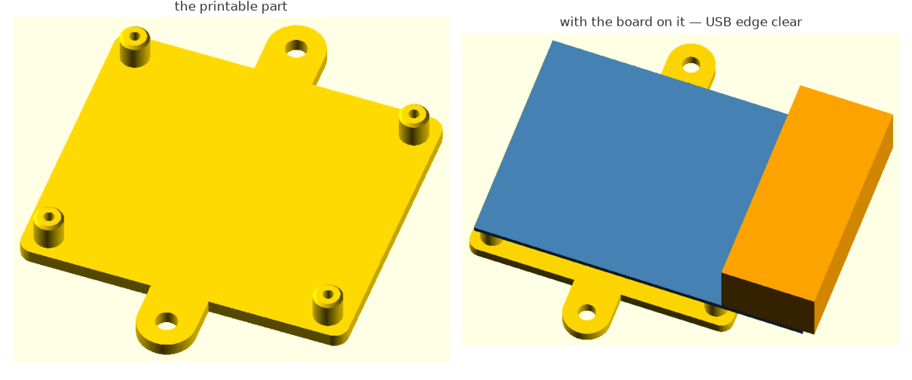

# OpenSCAD monorepo template

A starting point for designing 3D-printed parts with **OpenSCAD**, driven by **Claude Code**. You
describe the part and answer measurement questions; Claude Code writes the OpenSCAD, inspects what it
built with the tools in `tools/`, and iterates until it fits. Designs live under `projects/<x>/`,
reusable real-world components in `components/`, parametric primitives in `lib/`.

> [!NOTE]
> 📝 **The story behind it:**
> [Vibe coding for 3D design with OpenSCAD and Claude Code](https://www.elcacharrista.com/en/articles/vibe-coding-3d-design-openscad/)
> at El Cacharrista, which walks through how the harness came about and how I benchmarked it.
>
> <a href="https://www.elcacharrista.com/en/articles/vibe-coding-3d-design-openscad/"></a>

---

## What's the idea

Parametric part design is mostly a perception problem — does this clip clear that wall? is the bore
concentric? does the lid actually seat? — and Claude Code can already answer those. Hand it trimesh
and it will write a script to section the mesh, measure the bore and report back. The catch is that
it writes a *different* script every time: each iteration re-derives the measurement, the numbers
stop being comparable across runs, and every improvisation is one more chance to measure the wrong
thing — which you find out after printing.

So this repo does not give the model a capability it lacks; it makes one it already has
**repeatable**. Inspection becomes named tools with stable flags and stable output, the procedure is
written down as skills instead of reinvented each session, the conventions keep the codebase
navigable as designs grow, and adversarial reviewer agents judge the *method*, not just the numbers.

That is what **harness** means here: an environment around Claude Code — tooling, procedure and
guardrails — rather than a library it imports. The hooks say it best. A `PreToolUse` guard **blocks**
raw trimesh and hand-rolled OpenSCAD calls, which would be pointless if the agent couldn't take that
road: it can, and the guard keeps it on the paved one. Extend it — a tool in `tools/`, a primitive in
`lib/`, a step in a skill. Everything here has earned its place on real designs.

## Getting started

### Prerequisites

**OpenSCAD** on the PATH (or pass `--openscad <path>`; the Windows default is auto-detected) and
**[uv](https://docs.astral.sh/uv/)**.

```
uv sync                        # installs deps into .venv/
uv run tools/health_check.py   # 27 checks: OpenSCAD, deps, every tool imports
```

Then open the folder with Claude Code: `CLAUDE.md` and the skills in `.claude/skills/` load
automatically, and there is nothing else to configure. Read `projects/example/` to see the
conventions in miniature, and delete it once you have parts of your own.

> **Permissions.** `.claude/settings.json` pre-approves the headless tools so the loop doesn't stop
> for a prompt on every render. Anything that opens a window or serves a port still asks. Trim
> `permissions.allow` if you'd rather be asked for everything.

## Your first design — what to actually say

You drive this in plain language. You do **not** need to name a skill or a tool: a hook spots a design
request and points Claude Code at the right procedure. These are examples, not magic words.

**From measurements** — calipers, a datasheet, functional dimensions:

```
New project: a wall bracket for a Raspberry Pi 4. It screws to a wall and the
USB side has to stay clear.
```



*What that prompt produced in one session. Anchoring the frame on the board's mounting-hole rectangle
rather than on the board — the Pi's hole pattern is not centred — turns "the USB side has to stay
clear" into a number the model can `assert` against. (A rehearsal: the bracket itself is not part of
this repo — the starter project is `projects/example/`.)*

It creates `projects/<x>/`, picks an origin, models the part, and then asks you for **one measurement
at a time**, highest-risk first. Every constant carries its provenance — `// MEASURED:` where the
number is confirmed (here the board comes off the published Pi 4 drawing), `// ADJUST:` while it is
still an estimate — so you can always see what the design is guessing about.

Three things went wrong while that bracket was built, and each was caught by a **different** part of
the harness rather than by eye: an `assert` stopped the render because the wall tabs sat under the
board, where no screwdriver could reach them; `check.py` answered `watertight=NO` on faces that were
coplanar by construction; and the 3D view exposed a reference volume modelled twice as deep as the
real connector. None of the three would have shown up in a render that merely looked plausible.

**From a mesh** — a vendor STL you have to mate with:

```
projects/pump/resources/housing.stl is the part I need to bolt onto. Rebuild it
parametrically — the bolt circle and the flange thickness are what matter.
```

**Make it prove the fit, not just the numbers.** This is the habit worth building; the repo takes it
seriously enough to have a rule about it, because a part can be watertight, match on volume and still
be unusable:

```
Section the assembly where the lid meets the tray and show me whether the rim
actually seats. I don't trust the volume figure.
```

**Get something cheap to print before committing to the whole part:**

```
The lid clearance is still a guess. Give me a test coupon I can print in ten
minutes to check it.
```

Adding a piece to an existing project, or promoting a model once a second project needs it, work the
same way — just ask.

### Check the harness works

```
uv run tools/check.py projects/example/main.scad --module base_print
uv run tools/run_batch.py projects/example/main.scad
```

No mesh of your own to rehearse the STL flow on? Nothing binary is committed here, so make one with
the repo itself and treat it as a vendor mesh — the parametric source is right there, so you can
check what was recovered against what the model actually says:

```
./build.sh example
uv run tools/analyze.py projects/example/prints/example_base_print.stl
```

## What you run vs what Claude Code runs

Almost everything in `tools/` is the **agent's** instrument panel — inspection, sectioning, mesh
analysis, A/B diffing. You rarely call it by hand, so it isn't catalogued here: the full guide, with
an example and an image per tool, is [`docs/tools-guide.md`](docs/tools-guide.md). The three you
*will* run yourself:

| Command | What it does |
|---|---|
| `./build.sh <project>` | final STLs → `projects/<x>/prints/` (one per `*_print` piece) |
| `./catalog.sh` | browsable catalog of your projects with 3D thumbnails |
| `./docs.sh` | serves `docs/` as a searchable site (`./docs.sh build` writes `site/`) |

## Layout

| Path | What lives there |
|---|---|
| `projects/<x>/` | one design: `main.scad` (front door) + `modules/`, plus `drawings/` `resources/` `test/` as needed |
| `components/` | catalog of reusable real-world parts — one worked example, grow it with yours |
| `lib/` | general parametric primitives — likewise |
| `tools/` | the Python tooling Claude Code drives |
| `docs/` | reference documentation ([`docs/README.md`](docs/README.md) is the index) |
| `.claude/` | skills, reviewer agents, and the hooks that keep the agent on the paved path |

`lib/` and `components/` are meant to grow, so neither is catalogued: **each `.scad` documents itself
in its own header** (API, parameters, and why it is built that way). `build/` and `prints/` are
gitignored.

## License

MIT — see [`LICENSE`](LICENSE). Use it, fork it, adapt it to your own printer and your own parts.

No third-party code is bundled, so nothing here constrains how you licence what you build.
