# Tools guide (`tools/`)

This guide walks through the tools bundled with this agentic OpenSCAD design framework under the `tools/` directory. They give both the agent and the human designer the information needed to steer the design process: whether the 3D mesh has problems, whether design elements collide, or whether clearances are too tight.

---

## Setting up the environment

The tools are a [uv](https://docs.astral.sh/uv/) project: the Python dependencies are declared in `pyproject.toml` and pinned in `uv.lock`, so on that side all you need is uv installed (OpenSCAD is the other prerequisite — see below).

To install:

```bash
uv sync   # creates .venv/ with the dependencies from pyproject.toml (resolves uv.lock)
```

Run any tool with `uv run tools/<x>.py`. Don't activate anything: uv finds the repo's `.venv` and syncs it against the lock before running.

`check.py`, `slice.py`, and `run_batch.py` also need **OpenSCAD** installed. They locate it on their own; if it lives in a non-standard path, pass it with `--openscad <path>`.

To confirm the environment works, run the health check:

```bash
uv run tools/health_check.py
```

The output shows the status of every tool and its dependencies.

---

## Tool summary

The **When** column says which phase of the work each tool belongs to (summarized at the end, in
[the design loop](#the-design-loop-how-they-fit-together)).


| Tool | What it does | When it's used |
|---|---|---|
| [`health_check.py`](#health_checkpy) | Checks that the tools work correctly. | setup |
| [`build.py` / `./build.sh`](#buildpy--buildsh) | Build the project's **final** STLs into `prints/`. | loop output |
| [`check.py`](#checkpy) | Validate that the part is **printable** and that parts **don't collide**. | loop (criterion) |
| [`run_batch.py`](#run_batchpy) | The loop's **eye**: regenerates the project's iteration sections from its `main.batch` manifest (delegating each line to `slice.py`). | loop (eye) |
| [`slice.py`](#slicepy) | Sections part(s) on a plane (image DUO + measurements + polygons + SVG), or sweeps a whole axis (`--scan-axis`, JSON for analyze). | loop (analysis) |
| [`slice_viewer.py`](#slice_viewerpy) | **Section explorer**: pre-generates the sections on all 3 axes and navigates them in a GUI (axis + slider) + **captures useful sections to `main.batch`**; with **`--vs`** each slice is the `compare` overlay against a reference. | loop (exploration) |
| [`make_assembly.py`](#make_assemblypy) | From several loose STLs, an `stl_assembly.scad` with poses + a cut-plane viewer (for projects, the viewer is already in `main.scad`). | loop (GUI, occasional) |
| [`analyze.py`](#analyzepy) | Reconstructs a mesh's 3D features (bores, posts, bosses, openings, walls, recesses) by correlating slice sweeps. | front-loading |
| [`compare.py`](#comparepy) | A/B diff of two designs: overlays their sections and evaluates the differences per detector (acceptance criterion). | front-loading |
| [`render3d.py`](#render3dpy) | Renders the **whole part in 3D** from several angles (no cut plane), and a **deviation heatmap** against a reference: how far the model drifts. You see it whole, not in sections like `slice`. | loop (vision) |
| [`center_input.py`](#center_inputpy) | Relocates a vendor mesh (STL/DXF) to a known origin. | front-loading |
| [`dxf_smoother.py`](#dxf_smootherpy) | Smooths a DXF contour: arcs that come in **faceted** (polylines) → curve, preserving corners. | front-loading |
| [`dimsketch.py` + `drawings/`](#dimsketchpy--drawings) | Dimension drawings with provenance by color. | front-loading |
| [`gallery.py` / `./catalog.sh`](#gallerypy--catalogsh) | **Browsable catalog** of the repo served locally: one card per project (3D thumbnail + summary) and, inside, its pieces, drawings and docs. | inspection (outside the loop) |

This guide covers the **tools**. `tools/` also holds **source code that the tools use** (not invoked
directly, not tools themselves): `tolerances.json` (tolerance config for `compare`'s criteria),
`slice.scad` (headless cutting geometry), and the `_common.py` / `_geom.py` / `dimsketch.py`
libraries. The GUI inspection viewer, `cut_plane_viewer.scad`, lives in `lib/` (the `main.scad` files
import it; `make_assembly.py` copies it inline). How they fit together is in
[How they call each other](#how-they-call-each-other-dependency-map).

---

## `health_check.py`

The tooling's **initial check**: what you run before starting to make sure everything is in place. It
verifies that the libraries actually work — not just that they import, but that they run end to end on
a test part — that OpenSCAD is located and does a `.scad → STL` round trip, and that every tool
launches. If anything fails it exits with an error, so it **stops any automated script** and warns you
rather than charging ahead blind. Run it after setup and whenever something "just stops working for no
reason."

```bash
uv run tools/health_check.py
```

```text
openscad:
  [ok ] openscad render roundtrip      cube vol=1000mm3 watertight=True
tool scripts (import + argparse via --help):
  [ok ] run_batch.py                   OK
  [ok ] check.py                       OK
  ...
ALL 27 CHECKS PASSED — tooling ready.
```

---

## `build.py` / `./build.sh`

Builds a project's **final STLs** (the deliverables) into its `prints/`, at print quality (the
`main.scad` baseline `$fn`). It discovers the project's `*_print` modules on its own, so you don't have
to list them by hand. `./build.sh` is the shortcut that uses the venv for you (on Windows,
`build.cmd`).

```bash
./build.sh example                   # one STL per part (base_print, lid_print)
./build.sh example lid_print         # one specific part
./build.sh example --inspect         # also regenerate the main.batch sections (to build/)
./build.sh example --list            # list the project's *_print modules
./build.sh --all-projects            # build every project (CI)
```

With **`--inspect`**, after building the STLs it also runs the project's `main.batch` manifest (via
[`run_batch.py`](#run_batchpy)) and drops its PNGs in `build/`. These are two distinct destinations —
final STLs to `prints/`, inspection images to `build/` — so you regenerate both in one pass; compose
it with `--all-projects` to do it across the whole repo. A project without a `main.batch` is skipped
without error.

By default it builds **one STL per part** (each `<part>_print` module); name specific modules to build
only those, or **`--all`** to explicitly build every `*_print`. **`--fn N`** overrides the baseline
`$fn` and **`--openscad <path>`** forces the binary.

```text
build example:
  example_base_print.stl                   ok
  example_lid_print.stl                    ok
```

---

## `check.py`

The part's **automated validation**: if it doesn't pass, it exits with an error and stops the process
(handy inside a script or in continuous integration). It does two things, depending on how you invoke
it:

**Is it printable? (manifold)** — renders to STL and reports several indicators at once: `Status`
(OpenSCAD errors), `watertight` (whether the mesh is closed, with no holes), volume, bbox, and the
`Genus`. The **genus** is a topological measure: roughly, how many handles or tunnels the mesh has (a
simple solid part has 0; a ring, 1). Its exact value doesn't matter — what matters is that it **stays
stable**: an unexpected jump after an edit gives away geometry that fused badly or stray handles. A
`watertight=NO` with `Status=NoError` is usually a trimesh false alarm (coincident faces) — in that
case trust OpenSCAD's `Status`/`Genus`.

```bash
uv run tools/check.py main.scad --module <module>
uv run tools/check.py --all              # parts of the current project (cwd)
uv run tools/check.py --all-projects     # sweep ALL projects (for CI)
```

```text
  [ok ] main.scad [base_print]   Status=NoError  Genus=13  watertight=NO  vol=66.9cm3  bbox=99.0x118.5x11.0
```

**Do the parts collide? (clash + clearance, `--parts`)** — pass it the seated modules and, for each
pair, it checks whether they overlap (an overlap is a **clash**) and, if they **don't** overlap,
measures the minimum surface-to-surface **clearance** in mm. The matrix distinguishes: `0.00` =
touching · `+mm` = gap · `OVL` = clash. With `--min-gap G` it exits with an error if any clearance
drops below `G` mm, so you can use it as an automated gate.

```bash
uv run tools/check.py <asm>.scad --parts pack,box,lid
uv run tools/check.py <asm>.scad --parts pack,box --min-gap 0.8
```

```text
clash+gap check (eps=0.01 mm3): asm.scad
  gap(mm)/OVL       pack       box       lid
         pack          -      0.50      OVL
          box                    -      0.00
          lid                              -
  [ERR] box & lid overlap = 12.3 mm3  (collision)
```

> Clearance is **sampled** (approximate): it's the **number/criterion**. To **SEE** it in a section
> use `slice.py ... --parts` (below), which marks it per face on the plane you choose.

The **`--clash-eps mm³`** threshold (default 0.01) absorbs the numerical slivers of two coplanar
seating faces, so touching at 0 mm doesn't count as a clash. Like the other tools, it accepts
**`--fn`**, **`-D`**, and **`--openscad`**.

---

## `run_batch.py`

The inspection loop's **orchestrator**: in one pass it regenerates the set of sections you look at on
every iteration of a project. It does no geometry itself — it reads the **`<stem>.batch` manifest next
to the `.scad`** (`main.scad`→`main.batch`) and **dispatches each line to [`slice.py`](#slicepy)** as a
subprocess, naming each output after the line's `name`. It also accepts a path to any `.scad`, so the
reference assembly of an STL→parametric flow has its own slice-set in `stl_assembly.batch`.

```bash
uv run tools/run_batch.py example            # -> projects/example/build/main_*_{plot,preview}.png
uv run tools/run_batch.py projects/x/main.scad
uv run tools/run_batch.py projects/x/stl_assembly.scad   # -> reads stl_assembly.batch
```

### The `main.batch` manifest

Designing is **iterating**: you change a dimension, look again at **the same sections** (the ones that
expose THAT part's faults), adjust, repeat. Those sections are versioned in `main.batch`, alongside
`main.scad`. One line per section, format `<name>  <spec>  [parts=a,b]   # comment`:

```text
# example — iteration sections
front                    # central elevation (XZ): floor, cavity, lid lip
side                     # central elevation (YZ)
holders  z=4             # plan through the retainers: the four corner clips
seat     z=5.5           # plan at the PCB seating plane (floor + standoff)
joint    z=17.5          # plan where the lid lip sits inside the cavity wall
```

- **`name`** → the PNG root: `build/<stem>_<name>_{plot,preview}.png`. A **single-token** line (e.g.
  `front`) uses the spec as the name.
- **`spec`** → a **central section** `top`/`front`/`side` (a cut through the part's center — see
  [`slice.py`](#slicepy)) or an **explicit plane** `z=3.1` / `x=-10` / `y=0`.
- **`parts`** → front-door modules to cut (multicolor + per-face clearances); by default all `*_solid`.

> **The 3 central sections are the starting point, not the full list.** A part's fault almost never
> falls at the center of the bbox (a clip at `x=-38`, a clearance at `z=2`, an overhang in its print
> direction). Decide and **add the non-central position planes** that expose ITS fault — that's what
> gives the `main.batch` its value. In the example above, `holders z=4` and `joint z=17.5` are exactly
> that: one cuts through the PCB clips, the other through the lid joint — neither is a central plane,
> and both are where this part would fail.

Each line produces the `slice` **DUO** (preview = where it cuts + dimensioned plot with
dimensions/clearances). `run_batch` **clears `build/<stem>_*` before** regenerating, so `build/` ends
up holding only the **latest set**. The point: the set **travels with the project** (versioned) —
anyone regenerates the sections that matter in one shot, without rediscovering what to cut.
**`build.py --inspect`** launches it after building the STLs.

---

## `slice.py`

The **section primitive**: given a part (or several) and a plane, it dumps **everything that can be
known about that cut** — images, measurements, polygons, and SVG — in a single pass: it classifies
holes and arcs, detects **chamfers**, measures per-face clearances, and emits the raw geometry ready to
**reconstruct parametrically**.

```bash
uv run tools/slice.py part.stl z=1.5                         # 1 part, 1 color
uv run tools/slice.py projects/example/main.scad z=4 --parts base_solid,lid_solid   # several modules, multicolor
uv run tools/slice.py main.scad z=20,x=44 --parts lid        # several planes at once
uv run tools/slice.py part.stl z=1.5 --svg                   # adds the layered SVG
uv run tools/slice.py part.stl z=1.5 --only plot,poly        # only a subset of outputs
```

- **Input** — a `.scad` or an `.stl` (1 part, 1 color). **Several `.stl` → error**: it asks for an
  `assembly.scad` that composes them with their pose, rather than guessing.
- **Which modules of the `.scad` it cuts** — you choose with a single flag, **`--parts`**:
  - **`--parts X`** (one name) → **one** part, one color. To analyze the section of **one specific
    part** (its holes, walls, arcs).
  - **`--parts a,b,…`** (several) → each module rendered **separately** and with **its own color**. To
    see how **different parts fit together** (a fit); since there are ≥2 parts, it also computes the
    **per-face clearances** between them. They go separate because color is **lost through a CSG** —
    fusing them into one solid would flatten them to a single color.
  - **without `--parts`** → all the front door's `*_solid` (or the top-level if the file has none).
- **`--fuse`** → unites all chosen modules into **one single part** (one color, **no clearances**)
  rather than cutting each separately. Composes with `--parts` (fuses the named ones; by default, all
  `*_solid`). Useful to read the outline of the fused whole; on a single `.stl` it's a no-op.
- **`axis=pos`** defines the plane and position (`z=3.1`); accepts several separated by comma or space.
- **Central sections `top`/`front`/`side`** — shortcut to a cut through the part's **center**, without
  computing the coordinate by hand: `top` cuts ⊥Z (plan, XY), `front` ⊥Y (front elevation, XZ), and
  `side` ⊥X (side elevation, YZ), each at the midpoint of that axis's bbox. It's what the `main.batch`
  manifest uses (see [`run_batch.py`](#run_batchpy)). **`--name <n>`** renames the PNG root (by default
  the plane's name).
- **By default** it generates `preview` + `plot` + `poly`; **`--svg`** adds the SVG and **`--dxf`** the
  DXF (R12, one layer per part — for CAD/CAM). **`--only …`** selects a subset
  (`preview,plot,poly,svg,dxf`) and, if it hides detected features, **warns** (`also detected: 4
  fillets…`) so you don't lose track of them.

### The outputs

By default, `slice.py` generates **two images** (the DUO `_preview` + `_plot`) and **two text files**
(`_features.txt` + `_poly.txt`); with `--svg`, the layered SVG as well. All to `build/`, with the same
root `<stem>_<axis><pos>`.

**The image DUO.** Like every cut, it's paired with the 3D **`_preview`** that locates **where** it
cuts. Below, `demo.scad z=3 --parts plate_seated,peg_seated`: a two-part fit — a Ø11 peg seated in a
Ø12 hole — with the four 0.50 mm clearances:

| `_preview` (where it cuts)                    | `_plot` (auto-dimensioned)                    |
| -------------------------------------------- | ------------------------------------------ |
| 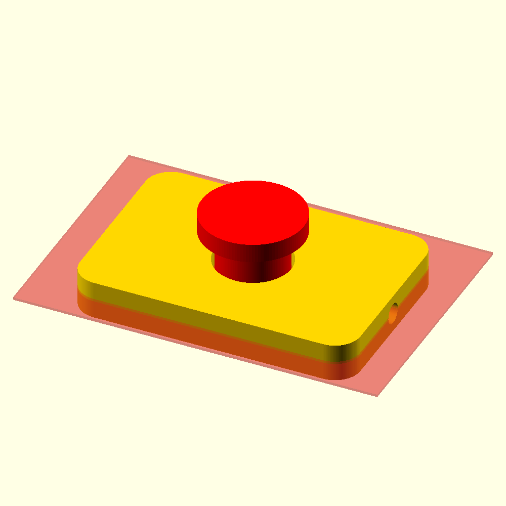 | 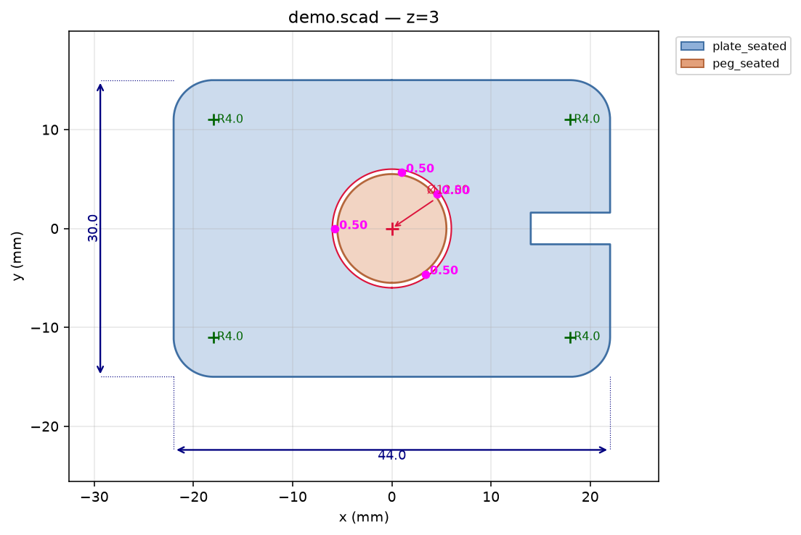 |

- **`_preview`** — the part(s) in color + the cut plane in **translucent red**, in iso.
- **`_plot`** — the **dimensioned** section: footprint, the **`Ø`** of round holes, the **`R`** of each
  arc/fillet, the **chamfers** with their angle, the **islands** (solid material inside a void, e.g. a
  post) marked with `×`, and — with **≥2 parts** — the **per-face clearances** between the faces that
  face each other (the `0,50` in magenta). One part per color, legend outside the drawing. Each part is
  filled leaving its **holes transparent** (not white), so in multi-part the void of one never covers
  the fill of another behind it.

A single plane doesn't tell the whole story: the **same fit at `y=0`** (a vertical cut, XZ plane) gives
the **profile**, and there a clearance appears that the plan view can't see — the vertical `1,12` the
peg rests on — in addition to the radial `0,50`. That's why it's worth cutting the same fit on
**several planes** in one pass (`slice.py … z=3,y=0`):

| `_preview` (profile: where it cuts)                  | `_plot` (profile: per-face clearance)                |
| -------------------------------------------------- | -------------------------------------------------- |
| 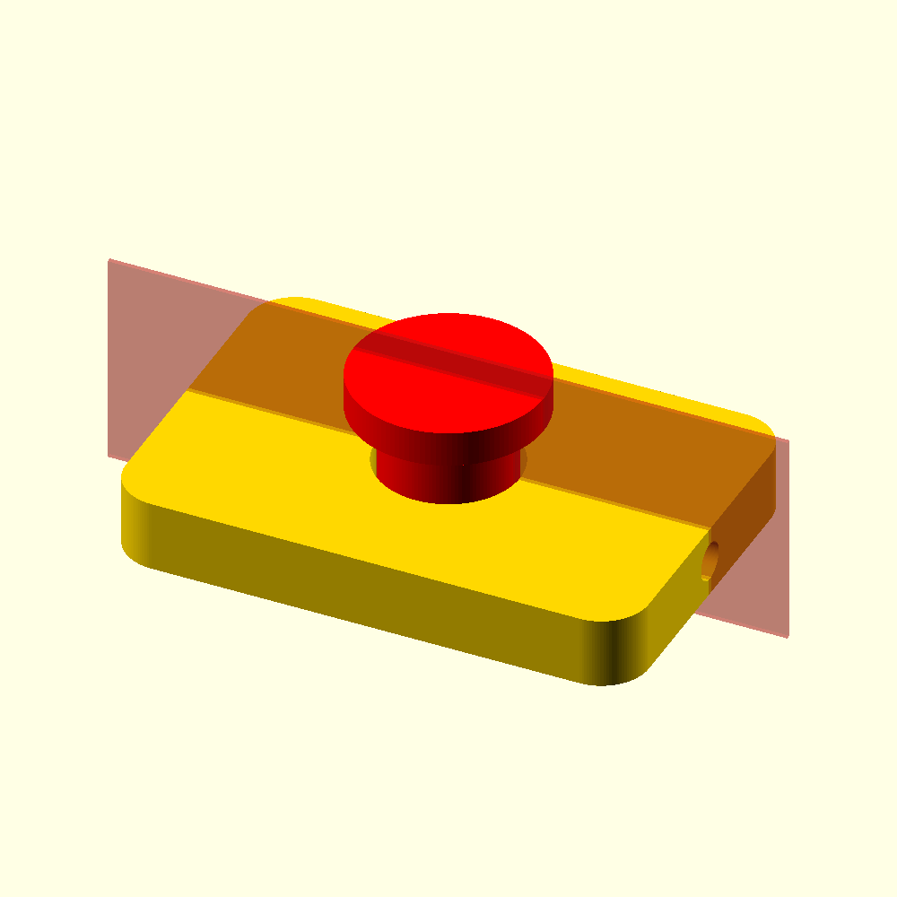     | 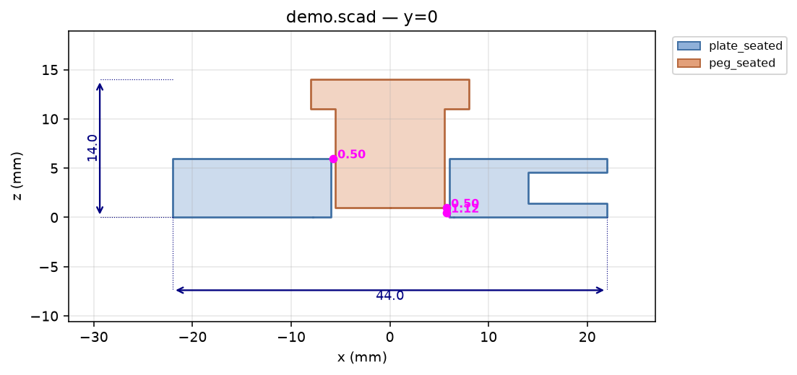        |

**The measurements** (`<stem>_<axis><pos>_features.txt`, also to the console): one line per feature,
**grep-friendly**, with the shapes + their **bounding box** but **without the points**:

```text
# id is the JOIN KEY: read a shape here, then grep id=<id> in _poly.txt for its points
PIECE plate_seated  footprint x[-22.00,22.00] y[-15.00,15.00] = 44.00x30.00  contours=1 holes=1 islands=0 fillets=4 chamfers=0
  OUTLINE id=plate_seated:o0  bbox=[-22.00,-15.00,22.00,15.00] n=377
  HOLE   id=plate_seated:h0 CIRCLE center=(0.00,0.00) bbox=[-6.00,-6.00,6.00,6.00]  d=12.00
  FILLET on=plate_seated:o0 R=4.01 center=(-17.99,10.99) span=90deg
PIECE peg_seated  footprint x[-5.50,5.50] y[-5.50,5.50] = 11.00x11.00  contours=1 holes=0 islands=0 fillets=0 chamfers=0
  OUTLINE id=peg_seated:o0  bbox=[-5.50,-5.50,5.50,5.50] n=241
  GAP plate_seated<->peg_seated face=-x min=0.50mm
  GAP plate_seated<->peg_seated face=+y min=0.50mm
```

Each hole is classified by shape (**CIRCLE / SLOT / RECT / POLY**) using `_geom.classify`'s ratios.
With **≥2 parts** the **`GAP`** lines appear: the minimum per-face clearance between the faces that
face each other. `FILLET`/`CHAMFER` aren't polygons of their own: they're features of a contour, so
they carry `on=<id of the outline>` they belong to.

**The raw polygons** (`<stem>_<axis><pos>_poly.txt`): one line per polygon, the **points** ready to
paste into `polygon()` / `linear_extrude`, minimizing tokens:

```text
OUTLINE id=plate_seated:o0 piece=plate_seated role=outline n=377 bbox=[-22.0,-15.0,22.0,15.0] pts=[[...],...]
CIRCLE  id=plate_seated:h0 piece=plate_seated role=hole    n=241 bbox=[-6.0,-6.0,6.0,6.0]      pts=[[...],...]
OUTLINE id=peg_seated:o0   piece=peg_seated   role=outline n=241 bbox=[-5.5,-5.5,5.5,5.5]      pts=[[...],...]
```

**The `id` is the join key** between the two files: you read a shape in `_features` (with its bbox,
without the noise of the points), find the one you want, and `grep id=<id>` in `_poly` gives you
**only** that one with its points. Each polygon carries a stable id per part — `o#` outlines, `h#`
holes, `i#` islands — of the form `<part>:h3`.

**The layered SVG** (optional, `--svg` → `<stem>_<axis><pos>_section.svg`): one Inkscape layer per part
(exterior + holes as an even-odd path) **plus a separate `cotas` layer** with the footprint, the
Ø/measurements, the R's and the angles — centers and arrows included — so you can turn the dimensions
on/off independently of the geometry. Python writes it from the already-computed coords (OpenSCAD gives
flat SVG, no layers).

### Robustness: cutting on a coplanar face

A plane that lands **right on a flat face** perpendicular to the axis (a floor/membrane, e.g. `z=0` on
a base) makes the sectioning **degenerate** (duplicate loops, phantom segments). `slice.py` **detects**
it — it looks for faces whose normal runs along the axis and that coincide with the plane — and
**nudges the cut by a negligible epsilon** (relative to the part) toward the center, sectioning solid
instead of grazing the face. It warns when it does (`ⓘ z=0 lands on a coplanar face of '<name>'; sectioned at
z=0.0097…`), so `z=0` "just works" without dodging it by hand.

### Axis sweep — `--scan-axis` (feeds `analyze`)

Instead of cutting at given planes, **`--scan-axis x|y|z|all`** sweeps the axis (or all 3) sectioning
every **`--step`** mm (default 1) and dumps the classified features **per level as JSON to stdout** (no
images). It loads the mesh **once** and sections in a loop (fast); `--range a,b` bounds the sweep to a
window (`analyze` uses it to refine a transition). It's the engine on top of which
[`analyze.py`](#analyzepy) reconstructs the 3D features; you rarely launch it by hand except to inspect
the raw JSON.

```bash
uv run tools/slice.py part.stl --scan-axis all          # JSON: features per level in x/y/z
uv run tools/slice.py part.stl --scan-axis z --step 0.5 # finer
```

### Projected silhouette — `--project x|y|z`

Instead of cutting at a plane, **`--project {x,y,z}`** projects the part along the axis and emits its
**silhouette** (the side/edge profile, keeping the thickness) — not a section. It's the tooling of the
**silhouette→DXF** idiom of the [design rules](design-rules.md): combine it with **`--dxf`** to extract
that profile as a DXF (which **carries the part's origin**) and reconstruct via
`linear_extrude`/`rotate_extrude`. The SVG (`--svg`) is view-only (its origin is the page corner, not
the part's).

```bash
uv run tools/slice.py main.scad --parts plate_solid --project x --dxf   # ⊥X profile → build/..._projx_section.dxf
```

### Other flags

- **`--fn N`** — render resolution of the preview. **`--size N`** — pixel side of the preview.
  **`--openscad <path>`** — if it isn't auto-located.

> For the global **number/criterion** of clearance (the minimum 3D between two parts, without choosing
> a plane) use [`check.py --parts --min-gap`](#checkpy); `slice.py` **shows** it to you located on the
> plane you choose.

---

## `slice_viewer.py`

A **section explorer**: it pre-generates the cuts at regular intervals on the **three axes** and lets
you navigate them in a simple GUI, stepping from one section to the next. Useful to *walk through* the
part and locate the interesting plane by eye (which you then cut with [`slice.py`](#slicepy) to
measure).

```bash
uv run tools/slice_viewer.py main.scad                 # all *_solid, step 2 mm
uv run tools/slice_viewer.py main.scad --parts lid_solid --step 1
uv run tools/slice_viewer.py part.stl --step 3
uv run tools/slice_viewer.py main.scad --reuse         # reopen the viewer without recomputing
uv run tools/slice_viewer.py main.scad --build-only    # only precompute (no window)
uv run tools/slice_viewer.py main.scad --vs ref.stl    # each slice = compare overlay vs the reference
```

It does two things in one command:
1. **Preprocesses** — loads the mesh once and sections it every `--step` mm along X, Y, and Z, writing
   each level's **DUO** (`<axis>_<idx>_preview.png` + `_plot.png`) and a `slices.json` manifest into
   `build/<stem>_slices/`. It reuses all of `slice.py` (same section, same detectors). The plots of one
   axis use a **fixed frame** (the part's full extent in that plane), so the whole stack shares the same
   pixel grid: a feature stays in the **same place** as you scrub the slider, like a CT scan.
2. **GUI** (matplotlib): an **axis radio** (x/y/z) and a **position slider**; moving them loads the
   matching `preview` (where it cuts) and `plot` (dimensioned section) side by side. All images are
   **preloaded into memory** and the two canvases update in place (`set_data`), with no disk read per
   tick → the slider stays fluid.

**Capture to `main.batch` (curating the slice-set).** The GUI has a panel to **turn what you explore
into the project's iteration slice-set**: when a section is worth keeping, you give it a **name** and
press **Save to batch** → it writes the line `<name> <axis>=<pos> [parts=…]` into the sibling
`main.batch` (the same one [`run_batch.py`](#run_batchpy) regenerates). The panel **lists** the current
entries: click one to **jump** to its section (loads its cut), or **Delete** to remove it; Save over an
existing name **replaces** it (no duplicates). The captured `parts=` reflects how you launched the
viewer (`--parts bottom_print` → `parts=bottom_print`; the default — all `*_solid` — is omitted). So
the human explores and decides which planes expose THAT part's fault, and the tool records them
consistently. (The panel requires a `main.scad` front door; with a loose `.stl` there's no `main.batch`
to write.)

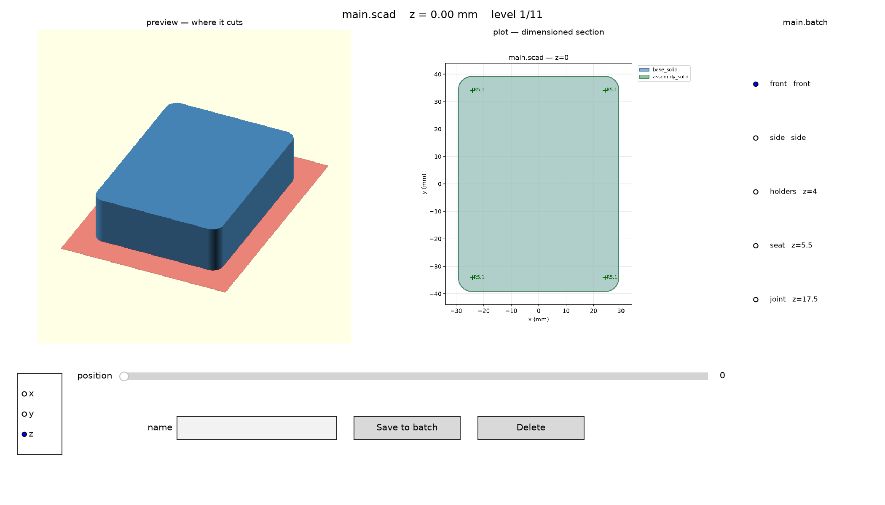

*Above: `slice_viewer` on the starter box — on the left the `preview` (the part with the red cut
plane), in the middle the `plot` with the section dimensioned; on the right the `main.batch` panel to
jump to (or capture) curated sections; below, the axis radio and the slider. It's a **user visual-inspection** tool: you open it to walk through the part by eye between
iterations, or when the agent gets stuck.*

- The preprocessing runs in a **subprocess** (renders headless): that way the parent process opens the
  window with an interactive backend. The cost scales with `1/step` (one preview render per level × 3
  axes), so a coarse `--step` is quick to sweep and a fine one is exhaustive.
- **The per-level renders run in parallel** (`--jobs`, by default **all cores**): each worker loads the
  already-baked STL once and splits up the levels — roughly an N-cores speedup over the serial sweep.
  `--jobs 1` forces it in-process (handy for debugging).
- **`--vs <ref.scad|.stl>`** (like [`render3d`](#render3dpy)'s `--vs`): each **`plot`** becomes the
  [`compare`](#comparepy) **overlay** on that plane — model in **blue** over the reference in **gray**,
  **red/orange** = deviation outside/inside tol — instead of the dimensioned section; the `preview`
  ("where it cuts") doesn't change. It's the **per-feature verification layer**: you walk through the
  part and check against the mesh whether each bore comes out **through on both faces**, whether a
  pocket is on the **correct face**, **hex vs round**, **conical countersink vs flat**, etc. — exactly
  what the numeric metric can't tell apart ([design-rules](design-rules.md): "a numeric PASS doesn't
  imply usable"). Both designs must be in the **same frame** (no alignment, like `compare`);
  `--vs-parts` chooses the reference's modules and `--tol`/`--tolerances` tune the overlay's
  tolerances. Where the reference doesn't cut a plane, that level falls back to the normal dimensioned
  section.
- **`--parts`** chooses which modules to section (by default all `*_solid`), just like `slice.py`.
- **It doesn't reprocess if nothing changed**: it **hashes** the baked mesh(es) + the parameters
  (`step`, `size`); if they match the sections on disk, it reuses the images (you only pay the bake,
  ~1 s) instead of re-sweeping. **`--force`** always redoes; **`--reuse`** doesn't even bake (opens the
  viewer straight over the existing slice store).
- **`--build-only`** only precomputes (for CI or manual inspection). The outputs go to `build/`
  (ephemeral, gitignored).

---

## `make_assembly.py`

Generates `stl_assembly.scad` for **several loose STLs**: the file you open in the GUI to sweep a
section plane (Customizer) and that `slice.py` consumes. **For a project it's not needed** — the cut
viewer is already **built into its `main.scad`** (the `[Inspect cut plane]` block): open it and move
`SHOW`/`CUT_POS`. `make_assembly` covers only the loose-mesh case, where there's no `main.scad`.

```bash
uv run tools/make_assembly.py a.stl b.stl             # -> ./stl_assembly.scad
uv run tools/make_assembly.py parts/*.stl -o asm.scad # choose the output name
uv run tools/make_assembly.py a.stl b.stl --stdout    # print, don't write
uv run tools/make_assembly.py a.stl b.stl --fuse      # treat them as ONE object (one fused _solid)
```

It wraps each STL in a `<name>_solid()` with an **editable pose** (`<name>_pos` translate +
`<name>_rot` rotate) and an `assembly()` that unites them. Loose meshes don't come positioned relative
to each other, so you **pose them yourself by editing those variables** — they live under
`/* [Hidden] */`, outside the Customizer (which shows only the cut plane, not 6 fields per part). The
pose lives in the **file**, not in Customizer presets, because the CLI render that `slice.py` runs
reads the values from the file (there they stay versioned and the cut respects them). The viewer is
**copied inline** from `lib/cut_plane_viewer.scad`, so the file is **self-contained and portable**: you
can move it or take it out of the repo and it still opens. It refuses to **overwrite** without
`--force` (it may have hand-tuned poses).

### The viewer in the GUI — `SHOW` + `CUT_POS`

You open the file (or a project's `main.scad`), open the **Customizer** (Window ▸ Customizer) and move
`SHOW` + the `CUT_POS` slider: the cut plane **sweeps the part in real time** (F5). It's where you
**discover by eye** at what height to cut before fixing it headless with [`slice.py`](#slicepy). Four
modes (`SHOW`):

- **`off`** — just the part, no plane (the **clean default view**; that's why it can live at the end of
  a `main.scad` without changing its default render).
- **`plane`** — the part + a **translucent red plane** at `CUT_POS`: **where** it cuts.
- **`cut`** — the part **clipped** by the plane (half-space): the section **in 3D, in place**.
- **`slice`** — the **true 2D section** at that plane: the clean contour to read the fit.

The `CUT_POS` slider range (shared across the three axes) is sized to the meshes' **bbox**.

| `SHOW = plane` (where it cuts)                          | `SHOW = slice` (2D section in place)               |
| ------------------------------------------------------ | ------------------------------------------------------ |
| 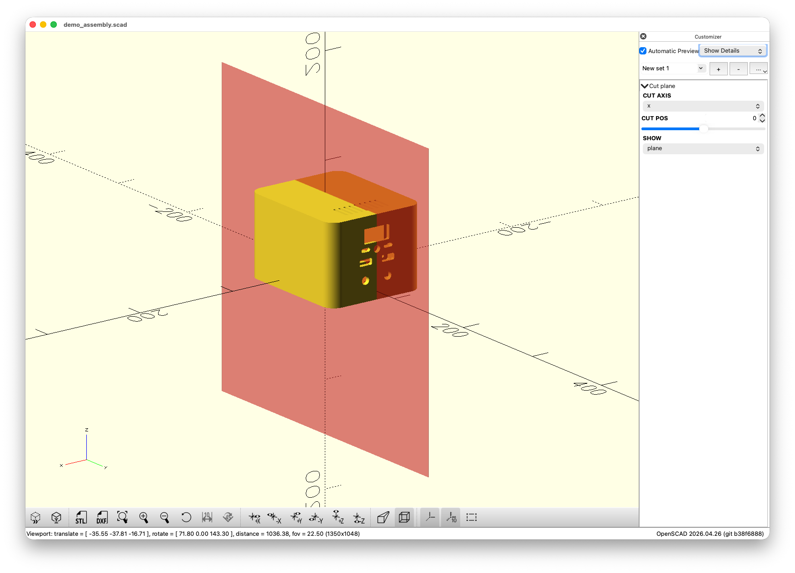 | 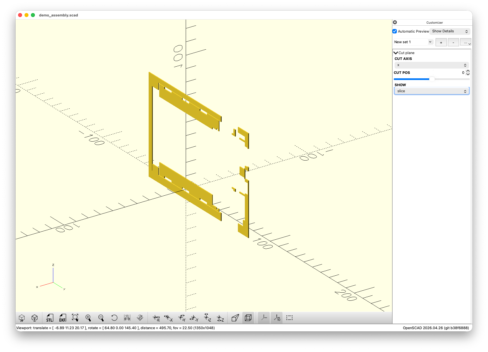 |

*A demo assembly file (an enclosure's posed parts — the shot predates the tool's current output name,
which is `stl_assembly.scad`) opened in OpenSCAD, with the `[Cut plane]`
Customizer on the right. Left, `SHOW=plane`: the red plane sweeps the part (you move `CUT_POS`). Right,
`SHOW=slice`: the true 2D section at that plane. (Missing: `cut` = the part clipped in 3D.)*

### How `slice.py` consumes it

The file ends in a top-level call `cut_plane_view(CUT_AXIS, CUT_POS, SHOW) …;` that's **only for the
GUI**: `slice.py` imports with `use`, which ignores top-level statements, so it sees only the
**modules** (`<name>_solid` / `assembly`). That's why the viewer coexists with the per-part cut without
getting in its way — equally in an `stl_assembly.scad` and in a project's `main.scad`:

```bash
uv run tools/slice.py stl_assembly.scad z=0              # cuts each *_solid separately (+ clearances)
uv run tools/slice.py projects/example/main.scad z=0     # the front door directly (the cut view is ignored)
```

---

## `analyze.py`

Reconstructs a **part's 3D features** — "what is this?" without opening it — and gives them as
**concrete coordinates, diameters, and lengths** that the LLM uses to refine the design. It's the first
step when modeling a component from a mesh: out of it come the Ø's, posts, walls, and openings that go
into the model as `MEASURED`.

It touches no geometry itself: it launches **`slice --scan-axis all`** as a subprocess (a dense sweep
in x/y/z, features classified per level as JSON) and **correlates** those 2D slices into 3D primitives.
The layering stays clean: `analyze → slice → _geom → trimesh`.

```bash
uv run tools/analyze.py part.stl                  # full analysis (3 axes)
uv run tools/analyze.py projects/example/main.scad --parts base_solid   # one front-door module (renders it to STL)
uv run tools/analyze.py part.stl --no-refine      # fast, dimensions ±step (no bisection)
uv run tools/analyze.py part.stl --debug-scad d.scad  # + .scad with the detections (see below)
```

What it detects (grep-friendly text to stdout):

```text
# analyze top.stl   (slice scan, step 1 mm)
# bbox x[-44.40,45.20]  y[-2.70,58.70]  z[-17.20,-0.35]
BORE      axis=z  center=(-19.00,3.50)  d=3.14  z[-14.20,-2.22]  len=11.98  internal
BOSS      axis=z  center=(-19.00,3.50)  d=5.59  z[-14.20,-2.22]  len=11.98  (post around internal bore Ø3.14)
STANDOFF  axis=z  center=(0.00,0.00)    d=5.00  z[2.01,9.99]     len=7.98   rooted
OPENING   SLOT   thru=x  center=(44.10,7.15,-9.98)  size=1.00x3.81x5.50  blind
CAVITY    RECT   center=(0.00,0.00,6.00)  size=36.00x26.00x7.98  walls: x-=2.00 x+=2.00 … z-=2.01 z+=open
  RECESS  z[2.01,5.99] wall x=2.00 y=2.00  ->  z[7.00,9.99] wall x=1.00 y=1.00
```

- **BORE / STANDOFF** (cylinders): a circle that persists along the sweep = a cylinder — Ø from the
  circle, length from the run, axis from the sweep; negative (void) = `BORE`
  (through/blind/internal), positive free-standing (island) = `STANDOFF`.
- **BOSS** (post with a bore): a bore that's **`internal`** (its mouth on an interior surface, not on a
  face) implies a recessed post around it — even if it's joined to the wall by a leg and isn't an
  isolated island. The collar's Ø is measured from the **arc** of its wall (`R`×2), not estimated.
- **OPENING** (CIRCLE/SLOT/RECT/POLY): openings that pierce a wall, with 3D size + thru-axis.
- **CAVITY + walls + RECESS**: a large cavity reports the **wall thicknesses** per face; if the
  thickness changes along the depth, a `RECESS` line gives the step.
- **Counterbore**: coaxial bores of different Ø are annotated as `(counterbore)`.

Method: it follows **tubes** of shapes per axis → turns them into 3D boxes → **groups** (one window
seen from 3 axes = one feature, without duplicating) → classifies → **refines** the internal ends by
bisection (see below). Tolerances are **ratio-based** (scale/shape-free), like the rest of the tooling.

### Resolution and bisection

The coarse sweep is at **`--step` mm** (default 1) — dense enough to detect changes. Each **internal
transition** (not on a face) is refined with a fine sweep **`--fine` mm** (default 0.05) bounded to its
window, so the length/depth comes out exact without sweeping the whole part finely. `--no-refine` skips
that refinement (faster, dimensions to ±`step`).

| Mode | Time (sbc_case mesh) | Precision |
|---|---|---|
| `--no-refine` | ~2.5 s | ±step |
| `--fine 0.25` | ~11 s | ±0.25 mm |
| (default) | ~40 s | ±0.05 mm |

### `--debug-scad` — see the detections

`--debug-scad FILE.scad` writes an OpenSCAD with each detection as a **colored primitive over the real
translucent part** (`%import`): BORE red · STANDOFF/BOSS green/yellow (cylinders) · OPENING orange ·
CAVITY cyan (boxes). You open it in OpenSCAD (F5) and check at a glance **where** it detected each
thing. It persists a `<stem>_part.stl` next to the `.scad` (the overlay's mesh).

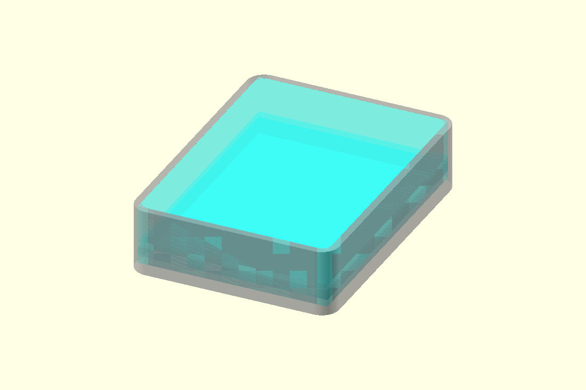

*`--debug-scad` on the starter box (`example_base_print.stl`): the real mesh in translucent gray and,
in colour, the `CAVITY` that `analyze` reconstructed — 54.40 × 74.40 with 2 mm walls all round. You
confirm at a glance that the detections land where they should.*

### Validation bench + limits

The features are validated against [`examples/analyze_tests.scad`](examples/analyze_tests.scad)
(through/blind/offgrid/counterbore/standoff/walled_box/recess_box) — known dimensions. Honest limits:
**axis-aligned only** (an inclined cylinder doesn't reduce to clean circles); the **collar Ø** of a
legged boss comes from the arc if there is one, otherwise it's **estimated** (`~bore×2`, marked `~`);
positive rectangular bosses deferred.

---

## `compare.py`

The A/B diff of two designs and the criterion of the "remodel a mesh with primitives" flow. **It
sections the two inputs on the same plane** (reusing [`slice.py`](#slicepy)) and **overlays** them: the
**REFERENCE** (the `.stl` mesh) in **filled gray** and the **MODEL** (the `.scad`) in **blue outline**.
It marks **in red** what **exceeds** the tolerance and **in orange** the differences that are **real
but within** tolerance. Each **detector** is a separate acceptance criterion, **except FILLETS**
(informational, not a criterion):

| Detector | What it compares | Tolerance |
|---|---|---|
| **VOLUME** | solid volume (Δ%) — only if both are watertight | `--vol-tol` (default 1.0 %) |
| **EXTENTS** | bbox extent **per axis** (Δmm) | `--tol` |
| **CONTOUR** | contour deviation (max ≈ Hausdorff + mean), **per plane** | `--tol` |
| **HOLES** | Ø/size of the paired holes + the ones **missing/extra**, per plane | `--tol` |
| **FILLETS** *(informational, not a criterion)* | radius (R) of the paired arcs, per plane | `--tol` (only paints red) |

> **Same frame, no alignment.** The two inputs are compared **as is**, with no rigid alignment: they
> must already be in the same position/orientation — that's ensured from the design, compare doesn't
> guess it. (This is the change from the old version, which aligned by PCA/ICP to tolerate a Y↔Z swap;
> now the common-frame responsibility belongs to the setup.)

```bash
uv run tools/compare.py model.scad reference.stl                       # MODEL (.scad) vs REFERENCE (.stl)
uv run tools/compare.py main.scad reference.stl --parts-a lid_solid    # choose the .scad's part
uv run tools/compare.py a.stl b.stl z=20 x=44 --tol 0.3                # explicit planes
```

- **Two inputs** (`.scad` or `.stl`). The **roles are detected by extension**, not by order: the
  `.stl` is the **REFERENCE** (gray) and the `.scad` the **MODEL** (blue) — it doesn't matter which you
  put first. (If both are the same type, fallback: 1st = gray, 2nd = blue.) `--parts-a`/`--parts-b`
  choose the module(s) on each side (`-a` = 1st argument, `-b` = 2nd; several are fused into one part).
- **Planes**: by default the three central sections `top`/`front`/`side`; pass explicit planes
  (`z=20`, `x=44`) or names to bound it. A **per-plane overlay plot** goes to `build/`.

```text
# compare  A=main.scad  B=box_variant.scad   (red = outside tol; orange = diff within tol; tolerances)
VOLUME    A=19.27cm3  B=24.07cm3  delta=+24.93%  (tol 1%)   [ERR]
EXTENTS   A=[58.40 78.40 19.00]  B=[60.40 80.40 19.00]  dmax=2.00mm  (tol 0.5)   [ERR]
PLANE z4 (xy)
  CONTOUR  max=1.99mm  mean=0.42mm  (tol 0.5)   [ERR]
  HOLES    matched=1  Ø/size-dmax=0.00mm  missing=0 extra=0  (tol 0.5)   [ok ]
  FILLETS  matched=0  R-dmax=0.00mm  (informational, no gate — CONTOUR is the truth)
  plot     build/main_vs_box_variant_z4_compare.png
RESULT FAIL — detectors outside tol: VOLUME, EXTENTS, CONTOUR(z4)
```

It exits with a code ≠ 0 if **any detector that is an acceptance criterion** (VOLUME, EXTENTS, CONTOUR,
HOLES — **not** FILLETS) exceeds its tolerance (the `RESULT` lists which ones, with the plane in
parentheses), so it serves as a criterion just like [`check.py`](#checkpy).

**The default tolerances live in `tools/tolerances.json`** — one **per detector**
(`contour`/`holes`/`fillets`/`extents`/`volume`), editable to tune them in a single place. Three
layers, each on top of the previous: the JSON → **`--tolerances other.json`** (an alternative set; keys
it doesn't define inherit from the default) → **`--tol`** (over the four mm detectors) / **`--vol-tol`**
per run.

```bash
uv run tools/compare.py A B --tol 0.2                  # tighten all mm to 0.2 this run
uv run tools/compare.py A B --tolerances tight.json    # a saved set (e.g. per project)
```

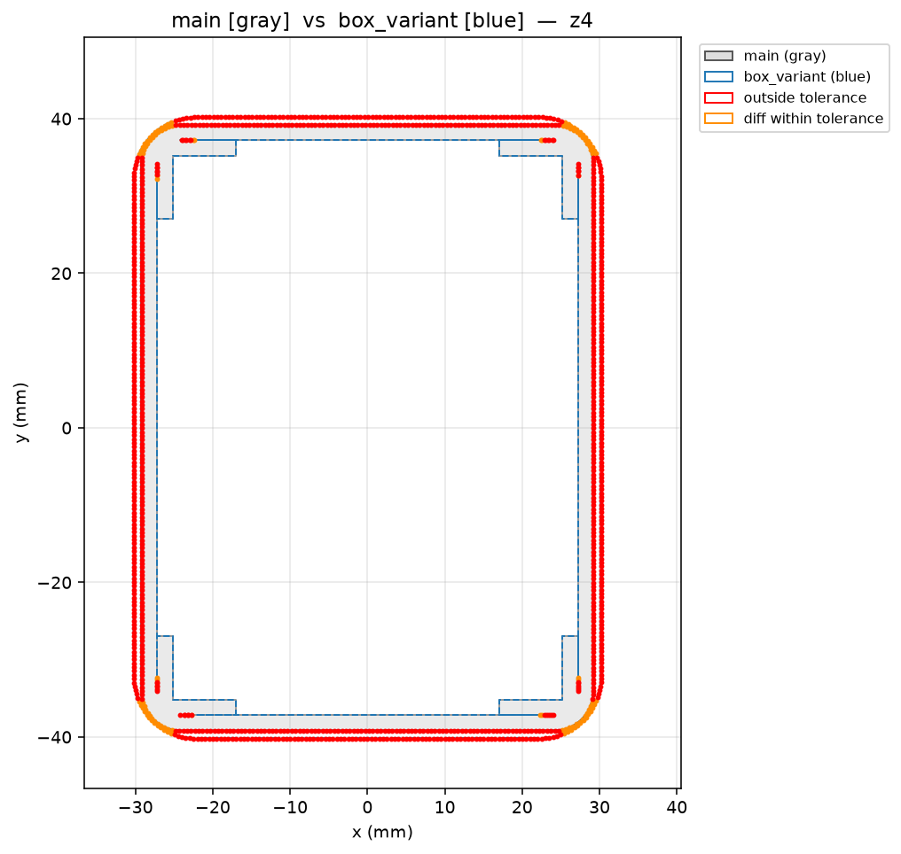

In the plot: **A (reference)** in filled gray, **B (model)** in dotted blue, and **in red** what
exceeds the tolerance — points on the contour where they separate, `Δ` on the holes with a different Ø
(`missing`/`extra` for the ones that don't pair), and `ΔR` on the fillets.

`compare` evaluates **fixed planes**, so a small feature can fall **between** two planes and go
unnoticed. To **see it in 3D from several perspectives** and catch those discrepancies, complement it
with [`render3d.py`](#render3dpy).

---

## `render3d.py`

Renders the **whole part in 3D** from several angles (without the cut plane that `slice`'s renders
carry), and a **deviation heatmap** against a reference. The difference from `slice`/`run_batch`: those
cut at a plane (they show *where* it cuts); this shows it **whole, in 3D, from several perspectives**,
and **how far** a model drifts from its mesh.

```
uv run tools/render3d.py projects/x/main.scad                 # *_solid, 4 iso angles -> build/<stem>_iso_<deg>.png
uv run tools/render3d.py projects/x/main.scad --parts a,b      # specific module(s), multicolor
uv run tools/render3d.py part.stl --angles 6 --size 1200
uv run tools/render3d.py projects/x/main.scad --vs ref.stl     # deviation heatmap
```

- **Input** = a `.scad` front door (it discovers `*_solid`, or choose with `--parts a` / `--parts
  a,b`) or an `.stl` directly. **`--angles N`** = number of views orbiting the part; **`--size`** the
  side of the PNG.
- **`--rx DEG` / `--rz DEG`** = a **custom iso camera angle**: instead of the default iso views, set
  the camera's elevation (`--rx`) and azimuth (`--rz`) by hand to frame a specific feature. (Without
  them, the views orbit at the default iso angles.)
- **`--vs <ref>`** (`.stl`/`.scad`) = **BIDIRECTIONAL deviation HEATMAP** → `*_heatmap.png`:
  - It colors the **two surfaces** by **real surface-to-surface distance**: the reference by its
    distance to the model (where the model is **missing** material) and the model by its distance to
    the reference (where it has **extra**) — green `<--vs-tol` (matches), yellow, orange, red `≥2 mm`.
    And it prints the **max/mean deviation** (bidirectional Hausdorff).
  - It handles **curved surfaces** well and **has no noise** (it measures the separation, not a boolean
    subtraction). It answers directly: *"how far does the model drift?"* (e.g. max 0.94 mm, all green
    except the bore). It's the honest fidelity measure, complementary to `compare` (per-plane
    Hausdorff).
- Outputs to the project's `build/`; binary via `locate_openscad` (or `--openscad`).

---

## `center_input.py`

Relocates a raw vendor mesh to a known origin, so you can import it as a reference solid. It doesn't
rewrite the original; it emits a centered one separately.

```bash
uv run tools/center_input.py resources/<name>.stl -o <name>_centered.stl -m xy-base
```

With **`-m`** you choose the **origin** (three modes): **`xy-base`** (default) centers in XY and rests
the base on z=0 — the usual FDM case; **`centroid`** brings the bbox centroid to the origin; **`min`**
brings the bbox's minimum corner to the origin. The `.scad` **never** imports from `resources/`: you
center first, then import the centered one.

- **`--flip x|y|z`** (STL) — rotates the mesh 180° about that axis **before** centering, for one that
  comes in upside down.
- **`--smooth`** + **`--angle`** / **`--points`** (DXF) — applies the [`dxf_smoother`](#dxf_smootherpy)
  smoothing before centering the contour, in a single pass.

---

## `dxf_smoother.py`

**Smooths a 2D contour (DXF)**: a vendor profile often arrives with **faceted arcs** — exported as
straight-segment polylines — and this turns them back into curves by adding interpolated (Bézier)
points in the continuous runs, **preserving the sharp corners**. It's not a relocator: to **center**
there's [`center_input.py`](#center_inputpy) (which can call this smoothing with `--smooth` and, in one
pass, smooth + center).

```bash
uv run tools/dxf_smoother.py resources/<name>.dxf <name>_clean.dxf   # output is positional
uv run tools/dxf_smoother.py in.dxf out.dxf --no-smooth             # only converts (POLYLINE→LINE)
```

> **`--no-smooth` — convert only.** It normalizes a DXF (POLYLINE/LWPOLYLINE) to OpenSCAD-readable
> `LINE`s **without** touching the geometry: it's the step of the **DXF profile protocol** (a CAD
> editor saves POLYLINE, which OpenSCAD doesn't import; you regenerate that intermediate after each
> edit of the profile).

Two parameters govern the smoothing: **`-a ANGLE`** (corner threshold, default 15°) — vertices with an
angle sharper than this are **kept sharp** (not interpolated), the rest are smoothed; and **`-p
POINTS`** (default 8) — how many points are generated per curved segment (more = finer contour).
Without `output`, it writes `<input>_smoothed.dxf`.

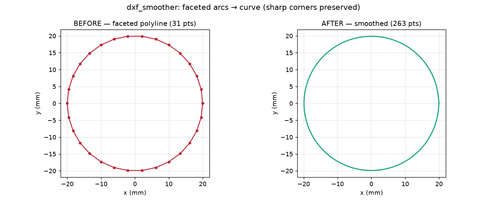

*Before/after on a faceted arc: the 31-straight-segment polyline (left) becomes a 263-point curve
(right) by interpolating the continuous runs.*

---

## `dimsketch.py` + `drawings/`

A **toolkit** for the LLM to draw a part's **parametric sketch**: a simple 2D schematic (matplotlib,
NOT a render) whose purpose is to make it **clear to the user which parameters they can touch and how
they affect the part**. Note: **it's not the geometry-faithful drawing** — for that there's
[`slice.py`](#slicepy), which comes from the real mesh — `dimsketch` is the *sketch of the knobs*. The
LLM provides the layout (simple boxes/circles); the toolkit provides consistent values, provenance, and
style, so you don't recode the image in each project. The `drawings/<name>_dims*.png` output is
**versioned**.

Three layers of helpers (the primitives `board_outline`/`rrect`/`circle`/`dim_h`/`dim_v`/`diameter`
are still there):
- **`read_params(scad)`** — parses `NAME = value; // MEASURED|ADJUST: desc` (following the `include`s) →
  the values and the **provenance** come from the `.scad` (single source): **constants are no longer
  copied nor is the color assigned by hand**.
- **`sketch(nviews)` / `finish(fig, path)`** — builds the figure (aspect-equal, hidden axes, legend,
  saving) without boilerplate.
- **`param_h/param_v/param_dia(ax, …, p, grows=…)`** — a dimension labeled **`NAME = value`** in its
  provenance color, with an arrow (`↔`/`↕`/`⌀`) that suggests how the part grows when the parameter
  goes up; **`param_table(ax, P, …)`** = the "touchable knobs" panel.

Two sketch conventions: (1) label with the parameter's **FULL name** (`PB_BMS_W`, not `BMS_W`) — the
user must see the exact identifier they'll edit; the `prefix=` that trims the prefix is a last resort,
not the normal case. (2) **All labels are in English** (it's a technical drawing whose identifiers are
code). `read_params` also tolerates a parenthesized qualifier in the
tag (`// MEASURED (user):`).

Provenance by color (in lockstep with the `.scad`'s tags): **blue `MEASURED`** (the user measured it) ·
**gray `ADJUST`** (an estimate to confirm) · **red** (still to be given, `?`).

**LLM process** (described in the `openscad-design-from-specs` skill): (1) analyze the part with `slice`
+ `read_params`; (2) decide which sketches to make — one per plane by default, extra views if the part
is complex; (3) draw them with the toolkit, centered on the touchable parameters.

```bash
uv run projects/<name>/drawings/<name>_dims.py   # regenerate the sketch PNG(s)
```

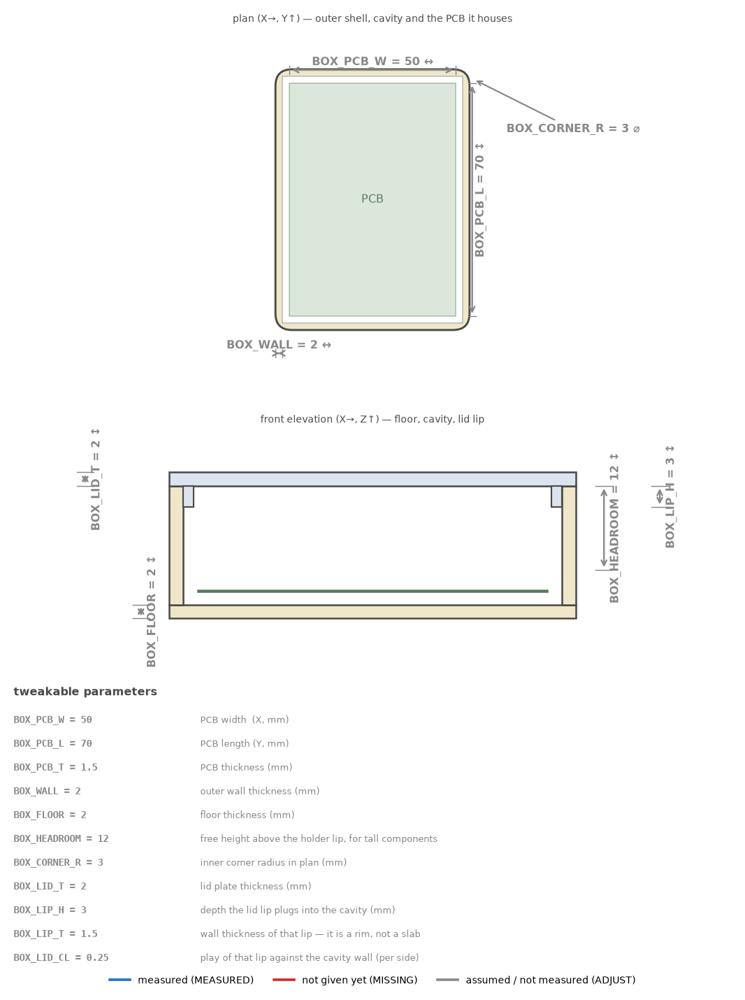

*Sketch of the starter box (`projects/example/drawings/example_dims.py`): each dimension carries the
**parameter name** (`BOX_PCB_W`, `BOX_WALL`, `BOX_LID_T`…) and an effect arrow; below, the **touchable
knobs** panel with value + description, all in gray because the starter is invented (`ADJUST`). The
values and colors come from the `.scad`.*

---

## `gallery.py` + `./catalog.sh`

The monorepo's **browsable catalog**: a local server showing **one card per project** with a 3D
thumbnail (rendered in the browser) and the summary pulled from its `docs/design.md`. Opening a
project shows **all its printable pieces** in 3D (the front door's `*_print` modules), its dimension
drawings (`drawings/`) and its rendered documentation. It is the showcase of what you have
accumulated — to reuse before reinventing.

The thumbnail STLs are rendered **on demand** through the same shared pipeline `build.py` uses
(never the raw mesh by hand) and cached; the cache is invalidated by the mtime of the project's
`.scad` files (+ `lib/` + `components/`), so editing a piece and reloading the page re-renders live.

```bash
./catalog.sh                                     # serve on http://127.0.0.1:8000 and open the browser
./catalog.sh 9000                                # another port
uv run tools/gallery.py --export gallery.html    # no server: ONE self-contained html (all inlined)
```

The UI starts in **English**; `--lang es` forces Spanish and `--lang auto` lets it follow the
browser. The EN/ES button in the corner switches it and remembers your choice.

`catalog.sh` is the convenience launcher: if a server is already running on that port it does
**not** start another (it just opens a tab), and otherwise it starts one and keeps it in the
foreground (Ctrl-C to stop). Works on macOS and on Windows (Git Bash / MSYS2). For the remaining
options (`--port`, `--fn`, `--open`, `--export`), as always, the tool's `--help`.

## `./docs.sh` — the documentation site

Everything under `docs/` can be read as a **browsable site** (MkDocs Material), with search and a
side nav, which usually beats opening loose `.md` files:

```bash
./docs.sh                # serve on http://127.0.0.1:8000, open the browser, live reload
./docs.sh --no-open      # serve without opening a browser
./docs.sh --port 8100    # another port (any `mkdocs serve` flag passes through)
./docs.sh build          # instead of serving, write the static site to site/
```

It opens the browser for you, like `catalog.sh` does — here it is `mkdocs serve`'s own `--open`
flag, which waits for the first build before opening.

The site lives in its **own uv project** (`resources/mkdocs/`), separate from the modeling tools:
it needs neither OpenSCAD nor trimesh, so it does not bloat the tools environment. The config
(`mkdocs.yml`, at the repo root) points at `docs/` and leaves the session notes out.

## How they call each other (dependency map)

The dependencies between tools flow in **one direction only: CLIs → libraries**. The CLI→CLI calls are
by **subprocess** (`run_batch` launches `slice`; `analyze` launches `slice --scan-axis`; `build
--inspect` launches `run_batch`; `slice_viewer` launches a subprocess of itself to preprocess
headless). The exception: **`compare` and `slice_viewer` import functions from `slice`** as a library
(`resolve_pieces`/`section_loaded`/`collect_features`/`emit_plot`/`emit_preview`…) — so `slice` is the
**single source** of the section + feature detection, and there's no second detector that drifts.

```
            ┌─────────────── libraries (not executables) ──────────────┐
            │  _common.py    (lightweight: paths, OpenSCAD, mesh_min_gap)│
            │  _geom.py      (2D-section: classify/arc_segments/        │
            │                segment_contour/face_section/safe_cut/dims)│
            │  tolerances.json (tolerances for compare's criteria)      │
            │  dimsketch.py  (dimension-drawing primitives)             │
            │  slice.scad    (cutter slice(axis,pos))                   │
            └──────────────────────────────────────────────────────────┘
   CLIs:  health_check · build · check · run_batch · slice · slice_viewer · analyze
          compare · render3d · center_input · dxf_smoother · make_assembly · gallery
   GUI (in lib/): lib/cut_plane_viewer.scad (cut_plane_view viewer; used by the main.scad files)
```

The 2D section geometry is centralized in **`_geom.py`** (used by `slice` and, through it,
`analyze`/`compare`/`slice_viewer`). `tolerances.json` is **DATA** (`compare`'s per-detector
thresholds, tunable in one place), not code. For each tool's specific flags, trust its `--help` (they
aren't documented here: they derive from the code and would drift out of sync).

> **METHOD criterion (no tool).** The construction method — that the part follows the repo's idioms,
> not just that it matches the silhouette — is **not** covered by any tool (a regex `lint_design.py`
> was tried and retired: it either duplicated `check` — coplanar faces already show up as `⚠
> watertight=NO` — or they were evadable textual tripwires). The method judgment is made by the
> **`design-conventions-reviewer`** subagent (disguised slice-stack? a curve that should be DXF? the
> right primitive? did you import the mesh?), guided by the `.scad`'s `// METHOD:` header. See the
> `openscad-design-from-stl` skill (pre-build and pre-delivery checkpoints), which sets the acceptance
> criterion: **number + method**, not the visualization.

## The design loop (how they fit together)

Designing a part isn't a single shot: it's an **iteration loop** — you change something, look at it,
adjust, repeat — until it fits. The key to understanding the tools is **what's INSIDE that loop and
what runs outside it (once)**:

```
  [once]              [once per component]                 THE LOOP (each iteration)             [output]
 health_check.py  ─▶   analyze.py / compare.py   ─▶   ┌─ you edit the .scad             ─▶   build.py
 (tooling ok?)         (extract dims from object)     │  run_batch.py / slice.py (look)       (STL to prints/)
                       dimsketch (dimension drawing)  │  check.py          (validate/criterion)
                                                      └─◀── adjust and repeat ───────────┘
```

- **Before the loop, once:**

  - **`health_check.py`** — after cloning, check that the tooling works.
  - **`analyze.py`** / **`compare.py`** / **`dimsketch`** — **front-loading**: only when you reproduce
    an external component from a **mesh**. `analyze.py` extracts the features (bores, posts, walls,
    openings) **once** to write the model's `MEASURED` constants; after that **it isn't called again on
    every iteration**. (In the *empirical path* — measuring with calipers — it isn't even used.) That's
    why **analyze.py is NOT in the loop**: it feeds the design, it doesn't iterate it.
- **The loop itself** (what the LLM/you touch on EACH pass):

  - **`run_batch.py`** / **`slice.py`** — the *section-first* eye: `slice.py` sections at a plane (image
    DUO + measurements), with `--parts` for the multi-part fits and their per-face clearances;
    `run_batch.py` regenerates in one shot the set of sections the project declares in its `main.batch`.
    It's what you look at after each change.
  - **`render3d.py`** — the eye in 3D: the **whole part from several angles** (what `slice` doesn't
    give) and, with `--vs <ref>`, the **deviation heatmap** against the mesh (how far the model drifts).
    Complements `compare.py` (numeric per-plane Hausdorff) with the visual reading.
  - **`check.py`** — the control: manifold + genus (printable?) and `--parts` (do the parts collide?).
    Fails with an error → stops the loop if something doesn't meet spec.
- **Occasional, to explore:** when you don't know **which plane** to look at, you discover it by walking
  through the part — live with the **`[Inspect cut plane]` block of `main.scad`** (you move
  `SHOW`/`CUT_POS` in the Customizer; for loose STLs, a `stl_assembly.scad` from
  [`make_assembly.py`](#make_assemblypy)), or as an explorer of precomputed sections across the 3 axes
  with [`slice_viewer.py`](#slice_viewerpy). What you find you cut headless with [`slice.py`](#slicepy):
  it's the bridge between exploration and the versioned cut.
- **Loop output:** when it fits and validates, **`build.py`** emits the final STLs to `prints/`.

The distinction matters because the **quality of the loop** depends on how well `slice`/`run_batch` +
`check` let you *see and validate* on each pass — that's where tuning the tools pays off most.
